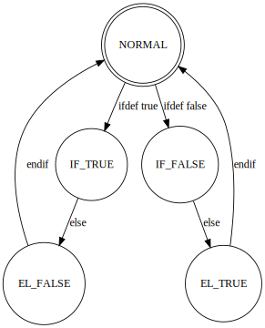

### Contents
[RTL_view](#RTL_View)  
[Usage](#usage)  
[Preprocessor Spec](#Preprocessor_Spec)

### RTL_View

1. Lark install
  pip3.7 install lark-parser

2. svgwrite install
  pip3.7 install svgwrite

3. graphviz install
  brew install graphviz

### Usage

<!--  -->

### Preprocessor_Spec

* NORMAL
  * none
* IF_TRUE
  * print 
* IF_FALSE
  * not print
* EL_TRUE 
  * print 
* IF_FALSE
  * not print
* EL_FALSE
  * print 
